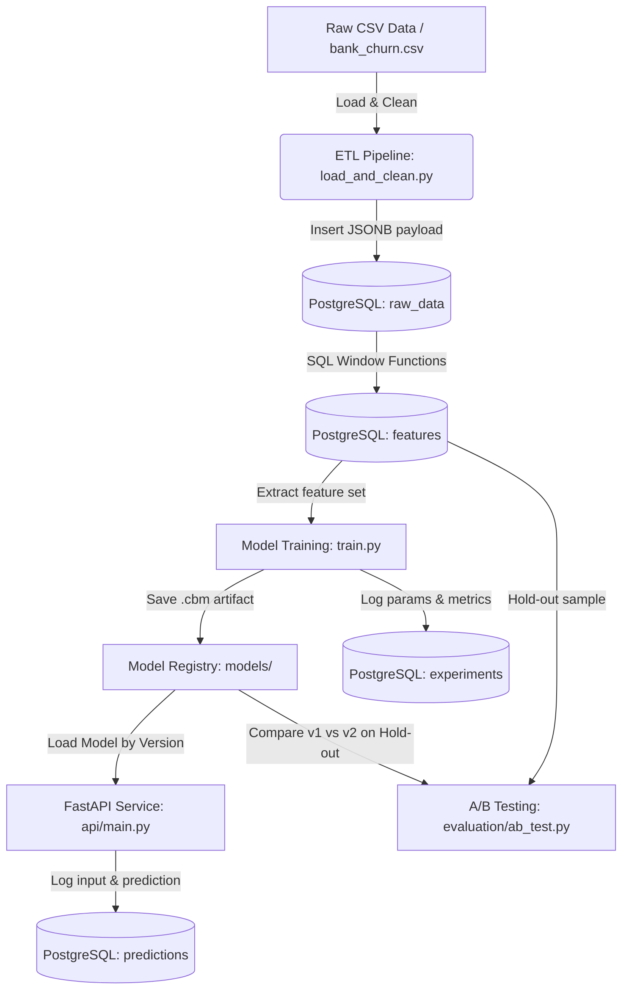

# 🚀 MLOps Pipeline in a Box

[](https://github.com/chernov-ramil-machinelearning/mlops-pipeline-box/actions)
[](https://www.python.org/)
[](https://fastapi.tiangolo.com/)
[](https://www.postgresql.org/)
[](https://catboost.ai/)
[](https://www.docker.com/)
[](https://docs.pytest.org/)


> **Автономный production-контур для машинного обучения (MLOps in a Box):** от загрузки сырых данных и SQL-фичаинжиниринга до версионирования экспериментов, микросервисного инференса и статистического A/B-сравнения моделей.

---

## 📌 О проекте

Основной фокус репозитория — **инфраструктура и инженерная обвязка вокруг ML-модели**:
1. **Реляционная БД и SQL Feature Store**: Хранение сырых и обработанных данных в PostgreSQL с использованием JSONB и оконных функций (`AVG OVER PARTITION BY`).
2. **Воспроизводимый ETL-пайплайн**: Очистка, дедупликация, валидация и загрузка данных.
3. **Трекинг экспериментов**: Фиксация гиперпараметров, артефактов и метрик (ROC-AUC, F1) в таблице `experiments`.
4. **Production API (FastAPI)**: Сервинг модели с поддержкой версий (`MODEL_VERSION`), валидацией схемы (Pydantic) и автоматическим логированием входящих запросов и предсказаний в БД.
5. **Статистическое A/B-тестирование**: Оценка значимости разницы между версиями моделей (Bootstrap доверительные интервалы + критерий Манна-Уитни).
6. **Контейнеризация и CI/CD**: Развёртывание одной командой через `docker-compose` и автоматическое тестирование через GitHub Actions.

---

## 🏗️ Архитектура системы



---

## 📂 Структура проекта

```text
mlops-pipeline-box/
├── .github/
│   └── workflows/
│       └── ci.yml                 # GitHub Actions CI workflow (pytest)
├── api/
│   ├── Dockerfile                 # Dockerfile для FastAPI сервиса
│   ├── main.py                    # FastAPI эндпоинты (/health, /predict) + логирование
│   └── requirements.txt           # Зависимости контейнера API
├── data/
│   └── bank_churn.csv             # Исходный датасет оттока клиентов
├── db/
│   └── init.sql                   # DDL-схема таблиц (raw_data, features, experiments, predictions)
├── etl/
│   └── load_and_clean.py          # Модуль загрузки, валидации и SQL-генерации фичей
├── evaluation/
│   └── ab_test.py                 # A/B-тестирование моделей (Bootstrap CI, Mann-Whitney U)
├── models/
│   ├── v1.cbm                     # Артефакт модели v1 (CatBoost)
│   └── v2.cbm                     # Артефакт модели v2 (CatBoost)
├── tests/
│   ├── test_api.py                # Unit-тесты для FastAPI (/health, /predict)
│   └── test_etl.py                # Unit-тесты для функций очистки данных clean()
├── training/
│   ├── experiment_log.py          # Модуль логирования экспериментов в PostgreSQL
│   └── train.py                   # Обучение CatBoost с выгрузкой фичей из БД
├── .env.example                   # Пример переменных окружения
├── .gitignore                     # Git ignore
├── docker-compose.yml             # Конфигурация запуска сервисов (БД + API)
├── requirements.txt               # Корневые зависимости проекта
└── README.md                      # Документация проекта
```

---

## 🗄️ Схема базы данных (`init.sql`)

- **`raw_data`**: хранение сырых данных в формате `JSONB` с сохранением `customer_id` и даты загрузки.
- **`features`**: подготовленные для обучения фичи (структурированный `JSONB`), рассчитанные с помощью SQL оконных функций.
- **`experiments`**: журнал запусков обучения с гиперпараметрами, метриками (`roc_auc`, `f1`) и путями к сохранённым `.cbm` артефактам.
- **`predictions`**: журнал предсказаний в проде (входной payload, скор модели, версия модели, timestamp).

---

## 🚀 Быстрый старт

### 1. Клонирование и настройка окружения

```bash
git clone https://github.com/chernov-ramil-machinelearning/mlops-pipeline-box.git
cd mlops-pipeline-box


# Создание виртуального окружения
python -m venv .venv
# Активация:
# Windows:
.venv\Scripts\activate
# Linux/macOS:
source .venv/bin/activate

# Установка зависимостей
pip install -r requirements.txt
cp .env.example .env
```

### 2. Запуск инфраструктуры в Docker

```bash
# Поднимает PostgreSQL (порт 5434) и FastAPI API (порт 8000)
docker-compose up -d
```

### 3. Запуск ETL (загрузка и трансформация данных)

```bash
python etl/load_and_clean.py
```
Скрипт очищает датасет, загружает сырые строки в PostgreSQL и рассчитывает фичи (включая средний баланс по группам `avg_balance_for_tenure`).

### 4. Обучение моделей и логирование

```bash
# Обучение базовой версии v1
python training/train.py --version v1 --depth 4 --iterations 200

# Обучение версии v2 с тюнингом гиперпараметров
python training/train.py --version v2 --depth 6 --iterations 400
```
Результаты обучения автоматически регистрируются в таблице `experiments`.

### 5. A/B Тестирование (Статистическая валидация)

```bash
python evaluation/ab_test.py
```
**Пример вывода:**
```text
=================== A/B Model Evaluation ===================
Sample size (held-out): 1000
Model v1 accuracy:      0.7930
Model v2 accuracy:      0.7910
Bootstrap mean diff:    -0.0021
95% Confidence Interval:[-0.0110, +0.0070]
Statistically significant (p < 0.05): False
Mann-Whitney U statistic: 501000.00, p-value: 9.1233e-01
```
> Статистически значимой разницы между v1 (depth=4) и v2 (depth=6) не обнаружено -
> усложнение модели не оправдано, в проде остаётся более простая и быстрая v1.
---

## 🔌 Работа с API

FastAPI документация Swagger UI доступна по адресу: `http://localhost:8000/docs`

### Healthcheck
```bash
curl -X GET http://localhost:8000/health
```

### Предсказание вероятности оттока (`/predict`)
```bash
curl -X POST http://localhost:8000/predict \
  -H "Content-Type: application/json" \
  -d '{
    "CreditScore": 650,
    "Geography": "France",
    "Gender": "Female",
    "Age": 40,
    "Tenure": 3,
    "Balance": 60000.0,
    "NumOfProducts": 2,
    "HasCrCard": 1,
    "IsActiveMember": 1,
    "EstimatedSalary": 50000.0,
    "avg_balance_for_tenure": 60000.0
  }'
```

**Ответ:**
```json
{
  "churn_prediction": 0,
  "churn_probability": 0.0816,
  "model_version": "v1"
}
```

Каждое предсказание автоматически сохраняется в таблицу `predictions` в PostgreSQL для последующего мониторинга дрифта данных и пост-анализа.

---

## 🧪 Тестирование

Запуск модульных тестов ETL и API:

```bash
pytest tests/ -v
```

Все тесты выполняются автоматически в CI пайплайне GitHub Actions при каждом `push` и `pull_request`.

